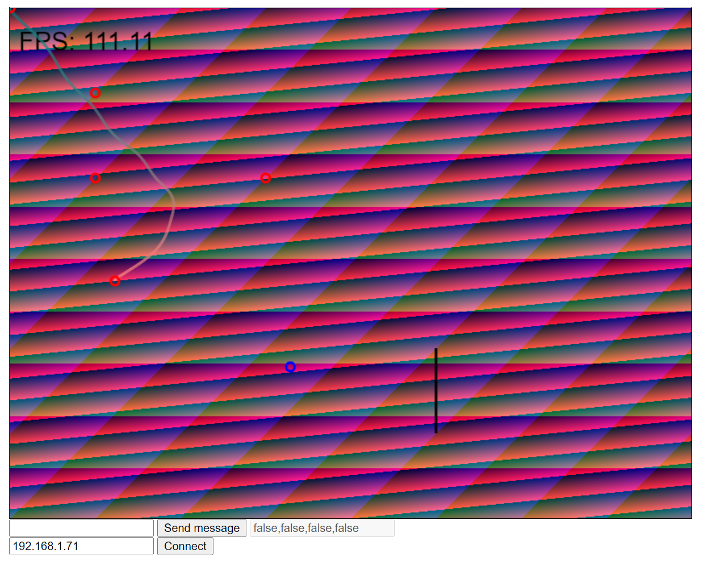

## Introduction

Testing websockets with a c++ server and a client written in JavaScript. Not sure about next steps for this application.



## Prerequisites

```
$ vcpkg install websocketpp
```

## Running

1. Start the server from Visual Studio
1. Run *game.html* in your browser
1. Enter your local IP address and press Connect